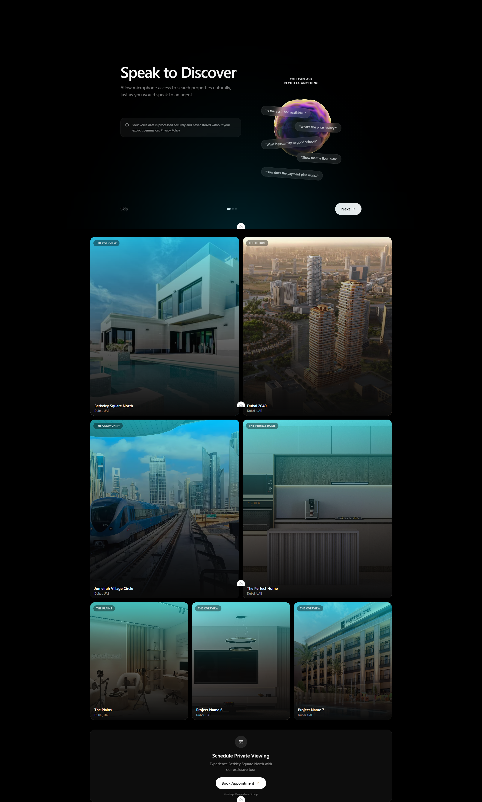

# Rechitta — Frontend-Focused SWE Assignment

A frontend implementation built with Vue 3, Nuxt 3, Tailwind CSS, and TypeScript, based on the provided Figma design.

## Demo

### Mobile


### Desktop



## QA Report — Figma Design

### Inconsistent pagination controls on Project Overview screens

The Project Overview screens show a page indicator (dots) without next/previous arrows, while every other screen that includes an indicator pairs it with navigation arrows.

This was treated as a design inconsistency rather than an intentional pattern, and the implementation follows the arrow-paired pattern used elsewhere for consistency.

### Background waves and glow differ between adjacent screens

The ambient background (wave lines and glow position/intensity) is not identical between the first screen and the ones that follow it, which causes a visible jump in the background when navigating from one screen to the next.

The implementation standardizes this background across all screens to keep transitions visually continuous.

### Project-specific overlay colors are not clearly defined

Each project uses an overlay with a different color, but the design does not specify whether these colors are predefined or dynamically generated.

If the colors are derived from the project image, there is also no guidance for cases where the extracted color conflicts with the visual design, such as an overly strong or saturated red.

The design should define the intended color source and how unsuitable colors should be handled.

## Stack & Tools

### Framework & Language

- Vue 3
- Nuxt 3
- TypeScript
- Tailwind CSS

### Development Tools

- VS Code
- Claude Code

### Browsers Tested

- Chrome
- Firefox
- Edge
- Brave

### Compatibility

- Screen readers
- Search engine crawlers

## Responsive Testing Coverage

### Mobile

- iPhone SE
- iPhone 16
- iPhone 16 Pro Max
- Pixel 9
- Pixel 9 Pro
- Pixel 10
- Samsung Galaxy A55

### Foldables

- Pixel 9 Pro Fold
- Galaxy Z Fold 6

### Tablets & Desktops

- iPad Mini
- iPad Pro 13
- Surface Pro 10

### Smart Displays

- Nest Hub Max

## Running the Project

### 1. Local environment

Requires an environment compatible with Nuxt 3. Developed and tested on Node `v24.16.0` or newer.

```bash
npm install
npm run dev
```

### 2. Docker (recommended)

A Dockerfile is included with all project dependencies. Build and run the container from the project root:

```bash
docker build -t rechitta-assignment .
docker run -p 3000:3000 rechitta-assignment
```

If a `docker-compose.yml` is present instead, use:

```bash
docker compose up --build
```

Once running, open `http://localhost:3000` in the browser.

## Assignment

Prepared for the Rechitta Frontend-Focused SWE Assignment.
